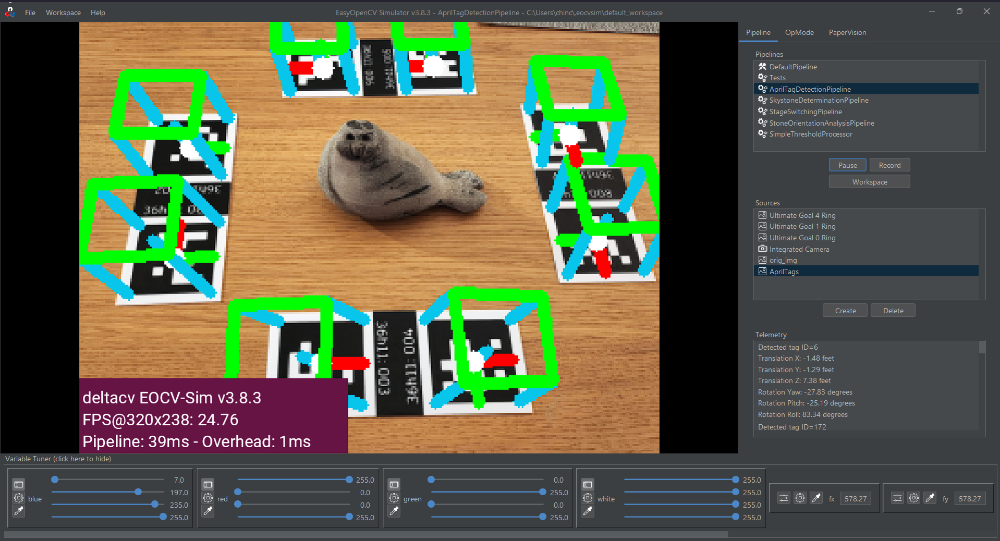
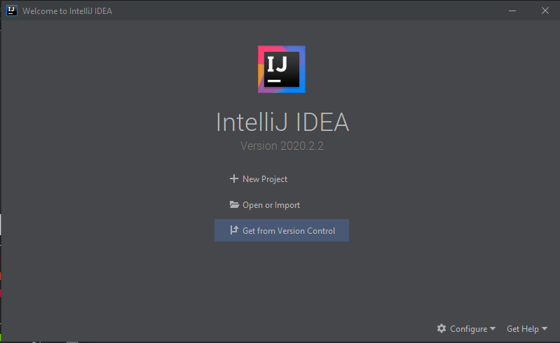
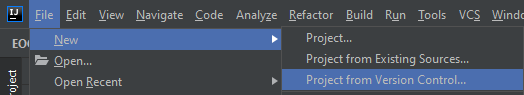
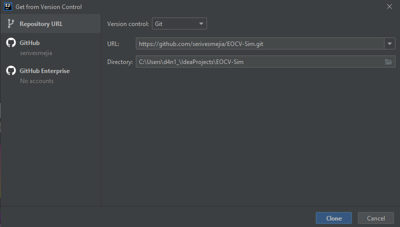
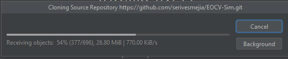
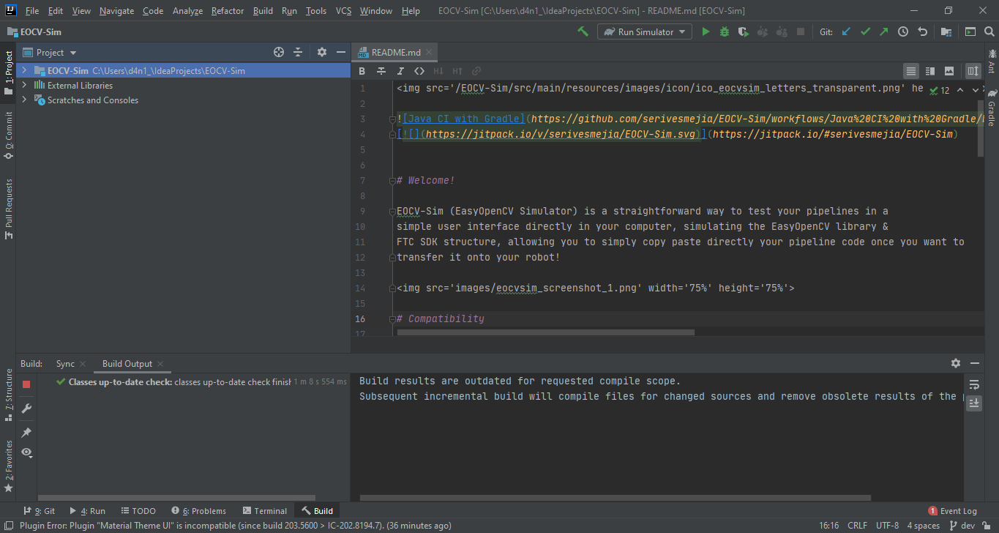

[](https://jitpack.io/#serivesmejia/EOCV-Sim)
[](https://repl.it/github/serivesmejia/EOCV-Sim)


# Welcome!

EOCV-Sim (EasyOpenCV Simulator) is a straightforward way to test your pipelines in a 
simple user interface directly in your computer, simulating the EasyOpenCV library & a bit of
FTC SDK structure, allowing you to simply copy paste directly your pipeline code once you want to 
transfer it onto your robot!



### If you'd like to learn how to use the simulator, you can find a complete usage explaination [here](https://github.com/serivesmejia/EOCV-Sim/blob/master/USAGE.md)

# Compatibility

Since OpenCV in Java uses a native library, which is platform specific, the simulator is currently limited to the following platforms:

* Windows x64 (tested)
* Windows x32 (untested)
* MacOS x64 (tested)
* Linux x64 (tested for Ubuntu 20.04)<br/>

# Installation

1) **Download & install the Java Development Kit if you haven't already:**<br/><br/>
      JDK 8 is the minimum required one, any JDK above that version will probably work fine.<br/>
      You can download it from [the Oracle webpage](https://www.oracle.com/java/technologies/javase-downloads.html),
      and here is a [step by step video](https://www.youtube.com/watch?v=IJ-PJbvJBGs) of the installation process<br/>

## Recommended method

1) **Make sure you have downloaded a JDK as mentioned above**

2) **Go to the releases page on this repo and find the latest version ([or click here](https://github.com/serivesmejia/EOCV-Sim/releases/latest))**

3) **Download the jar file, named `EOCV-Sim-X.X.X-all.jar`, available at the bottom on the "assets" section**

4) **Choose and install an IDE/text editor**<br/><br/>
      The recommended text editor is VS Code, with the Java Extension Pack. EOCV-Sim provides direct support for it, for creating a "VS Code Workspace" from a template, although it can also be imported into IntelliJ IDEA since it's just a normal Gradle project.
      
      This installation method provides the benefit of "runtime compiling", which means that the user pipelines are compiled and loaded on the fly and therefore the changes made in code can be reflected immediately, as opposed to the [old IntelliJ IDEA method](#altenative-installation-method-intellij-idea) in which the simulator had to be closed, compiled and then opened again to apply the smallest change made in a pipeline. Plus, VS Code is a lightweight editor which provides Java syntax highlighting and IntelliSense with the Java Extension Pack, making development of pipelines easy with tools like code completion.

     You can download and install VS Code from the [Visual Studio page](https://code.visualstudio.com/). The [Java Extension Pack](https://marketplace.visualstudio.com/items?itemName=vscjava.vscode-java-pack) can be installed from the [VS Code extension marketplace](https://code.visualstudio.com/docs/introvideos/extend).
     
     Here's a [tutorial video](https://www.youtube.com/watch?v=KwnavHTOBiA) explaining how to download and install VS Code & the Java Extension Pack

5) **Running EOCV-Sim**<br/><br/>
     For running the sim, simply double click the jar file downloaded from the releases page, or it can also be executed from the command line:
     ```python
     java -jar "EOCV-Sim-X.X.X-all.jar"
     ```
     
     When running on Linux (distros such as Ubuntu, Linux Mint, etc) or Unix-like secure operating systems, it might prohibit you to run it by double clicking the file from a file explorer. This can be fixed by giving execute permissions to the jar file with the following command
     ```bash
     chmod +x EOCV-Sim-X.X.X-all.jar
     ```
    
**Now the sim should be running without any issues! If you find any problem feel free to open an issue, and check the [usage explanation](https://github.com/serivesmejia/EOCV-Sim/blob/master/USAGE.md) for more details about how to use the simulator (and VS Code).**

## Altenative installation method (IntelliJ IDEA)

No complicated setup is required for this method either, it's straight up importing the EOCV-Sim project into IntelliJ IDEA:

\**The downside of this method is that this repo has grown to a considerable amount of space, due to a bloated history, and takes some time to clone, and also builds can be slower depending on your device.*

1) **Make sure you have downloaded a JDK as mentioned [here](#installation)**

2) **Download & install IntelliJ IDEA Community IDE if you haven't already:**<br/><br/>
      You can download it from the [JetBrains webpage](https://www.jetbrains.com/idea/download/)<br/>
      Here is another great [step by step video](https://www.youtube.com/watch?v=E2okEJIbUYs) for IntelliJ installation.
     
3) **Clone and import the project:**<br/>

      1) Open IntelliJ IDEA and in the main screen click on "Get from Version Control"<br/>
      
            <br/><br/>
         Alternatively, if you already had another project opened, go to File > New > Project from Version Control...<br/><br/>
            
            
      2) Another window will show up for cloning and importing a repository into IntelliJ<br/>
      
         1) In the "URL" field, enter: ```https://github.com/serivesmejia/EOCV-Sim.git```<br/>
         2) The directory can be changed, but it will be automatically filled so it's not necessary.
         3) Make sure the "Version control" is set to "Git".<br/><br/>
			<br/>
         4) After that, click on the "Clone" button, located at the bottom right and the cloning process will begin...<br/>    
			<br/>
         5) After the cloning finishes, the project should automatically import and you'll have something like this:<br/><br/>
            <br/>
            
### And you're ready to go! Refer to the [usage explanation](https://github.com/serivesmejia/EOCV-Sim/blob/master/USAGE.md) for further details on how to utilize the simulator.<br/>

## From the command-line

   1) Clone EOCV-Sim repo and cd to the cloned folder
   
	 git clone https://github.com/serivesmejia/EOCV-Sim.git
	 cd EOCV-Sim
   \**Or it can also be manually downloaded as a ZIP file from GitHub*<br/>

   2) Run EOCV-Sim through gradle:
  
	 gradlew runSim
	 
   \**On some command lines (like Windows PowerShell) you might need to execute "./gradlew" instead*<br/>
	 
#### And that's it! You might need to wait a bit for gradle to download all the dependencies but EOCV-Sim will open eventually.
	 
## From repl.it

   1) Click [here](https://repl.it/github/serivesmejia/EOCV-Sim) to go to repl.it, you might require to create an account if you haven't already. Once you do that, it will automatically create a new project and start cloning the EOCV-Sim repo.
 
   2) After the cloning is finished, click on the green "Run" button at the top and EOCV-Sim should start.
  
   \**Please note that this method is not widely supported and you might run into some issues or lack of some functionality.*<br/>
	 
	
## Adding EOCV-Sim as a dependency

   ### Gradle
   ```groovy
   repositories {
       maven { url 'https://jitpack.com' } //add jitpack as a maven repo 
   }
   
   dependencies {
      implementation 'com.github.serivesmejia:EOCV-Sim:3.0.0' //add the EOCV-Sim dependency
   }
   ```
   
   ## Maven
   
   Adding the jitpack maven repo
   ```xml
    <repositories>
		<repository>
		    <id>jitpack.io</id>
		    <url>https://jitpack.io</url>
		</repository>
	</repositories>
   ```
   
   Adding the EOCV-Sim dependecy
   ```xml
    <dependency>
	    <groupId>com.github.serivesmejia</groupId>
	    <artifactId>EOCV-Sim</artifactId>
	    <version>3.0.0</version>
	</dependency>
   ```

# Contact
For any quick troubleshooting or help, you can find me on Discord as *serivesmejia#8237* and on the FTC discord server. I'll be happy to assist you in any issue you might have :)<br/><br/>
For bug reporting or feature requesting, use the [issues tab](https://github.com/serivesmejia/EOCV-Sim/issues) in this repository.

# Change logs

### [v3.0.0 - Compiling on the fly! Yay!](https://github.com/serivesmejia/EOCV-Sim/releases/tag/v3.0.0)

   - This is the 9th release for EOCV-Sim

      - Changelog:
        - Runtime building! The sim now supports building pipelines on the fly, which allows for more quick and efficient testing. (Running the sim with a JDK is required for this feature to work, since normal JREs don't include a compiler to use)
        - Workspaces & VS Code is the new (and recommended) way of developing pipelines. A VS Code workspace template can be created from the sim, see the usage explanation for more details.
        - A file watcher was implemented, so when any modification happens in the current workspace under the "source" or "resource" folders specified in the `eocvsim_workspace.json`, a new build will be automatically triggered every 8 seconds.
        - VS Code can be executed by the sim if the current system has the `code` command. It is triggered by manually opening it in the top menu bar or when creating a VS Code workspace.
        - Files can now be drag and dropped into the sim to add them as Input Sources. The sim will automatically open a create dialog depending on the file extension.
        - Added a "Workspace" menu under the top menu bar, which contains the new features regarding the runtime compiling.
        - The UI now has smoother icons, by using a smoothing option on Java swing which makes them look a little nicer (but not much).
        - Current pipeline state is now stored and reestablished if a restart happens.
        - When a build is finished, the simulator tries reinitializes the currently selected pipeline if it exists, to ensure the changes were applied. Or it falls back to the `DefaultPipeline` if the old pipeline doesn't exist anymore, it also saves the state of the old pipeline and tries to apply the snapshot of the pipeline before it was reinitialized if the names of the old and new classes match.
        - The sim now uses a `.eocvsim` folder under the user directory to store its files, to avoid annoying the user with unwanted files now that the runtime compiling exists and it has to store the build output somewhere. If the user has previously run an older version of eocv sim which created `eocvsim_sources.json` and/or `eocvsim_config.json` under the user home directory, it automatically migrates them to the new folder. 
        - Builds created by IntelliJ Idea (the common programming style) are now considered as "dev". This helps to distinguish between official & published builds created in a CI workflow and local builds, when an issue happens and it's reported.
        - The sim compiling target was changed back to Java 8, since this is one of the most widely used versions and we weren't really using many Java 9 features that couldn't have been replaced or handle different. This is also more convenient and provides better support for users directly downloading the jar and executing it.

      - Bugfixes:
        - Fixed issues with the source selector regarding to selection when a modification or error happens. When a new source is added, it's automatically selected. And when a source is deleted, the previous source in the list is selected
        - Fixed the color picker cursor size on non-windows systems
        - Fixed pause not working when a tunable field that uses a combo box in the UI is included.
        - Fixed an (apparently random, but it's just the garbage collector being weird) null pointer exception with `Enum` fields

      - Internals:
        - Improved event handlers to be more idiomatic and less weird. Bye bye KEventListener!
        - Improved some messy parts of the internal code and logic

### [v2.2.1 - JVM crashing hotfix](https://github.com/serivesmejia/releases/tag/v2.2.0)
 
   - This is the 8th release for EOCV-Sim
   
      - Changelog:
        - Removed "Java memory" message in the title since it's practically useless for the end user
        - Updated to Gradle 7.0 for Java 16+ support (#25)

      - Bugfixes:
        - Fixed JVM crashing error caused by releasing all mats in a MatRecycler finalization (#26)
        - Improved memory usage by deleting unused BufferedImageRecyclers, memory is now slightly freed when allocating or recycling buffered images of different sizes (which means that the memory usage is reduced a little bit when zooming in the viewport)

### [v2.2.0 - Variable Tuner Upgrade](https://github.com/serivesmejia/releases/tag/v2.2.0)
 
   - This is the 7th release for EOCV-Sim

      - Changelog:
 
        - Pipelines now have a timeout all of the three methods so that the main loop doesn't get compromised due to a "stuck" pipeline (using kotlin coroutines)
  	    - processFrame has a timeout of 4.2 seconds
  	    - init is executed in the same scope as processFrame, when it has to be called, the timeout is doubled (16.4)
  	    - When either processFrame or init methods timeout, the sim automatically falls back to the default pipeline and discards any frame that the old timeouted pipeline could return.
  	    - onViewportTapped is still called from the U.I Thread, but it now has a timeout of 4.2 seconds too
        - Added EnumField which handles the type Enum (accepts all classes of type enum, including the ones declared by the user)
        - Major improvements to the variable tuner, added new features for color picking, tuning with sliders, configuration... See [usage explanation](https://github.com/serivesmejia/EOCV-Sim/blob/master/USAGE.md) for further details.
        - GUI improvement: Dropped some external dialogs in favor of simple "popups" for more practicality
        - Internals:
    		- Continued rewrite to kotlin
    		- Splitted visualizer class components into different classes
    		- Improved EventHandler doOnce listeners

### [v2.1.0 - Video Update](https://github.com/serivesmejia/EOCV-Sim/releases/tag/v2.1.0)

   - This is the 6th release for EOCV-Sim

      - Changelog: 

        - Added support for VideoSources! You can now input your pipeline with a moving video (*.avi format is the most supported and tested, other codecs might depend on the OS you're using)
        - Added support for video recording, accessible at the bottom of the pipeline selector. Save format is AVI
        - Added a new TunableField type: RectField, which handles the OpenCV type "Rect" (might be useful for rect pipelines 👀)
        - Improved uncaught exception handling and added a crash report generator
        - Added support for more themes from FlatLaf
        - Added new config option to change the output video recording size
        - Added support for EOCV's TimestampedOpenCvPipeline
        - Internals:
    		- Major rewrite to kotlin! (Still mostly Java but that might change soon)
    		- A bit of code cleaning and restructuring 

### [v2.0.2 - TaskBar hotfix](https://github.com/serivesmejia/EOCV-Sim/releases/tag/v2.0.2)
      
  - This is the 5th release for EOCV-Sim.
      
      - Bugfixes:
        
        - Fixes UnsupportedOperationException with the TaskBar API in some operating system
            
### [v2.0.1 - BooleanField hotfix](https://github.com/serivesmejia/EOCV-Sim/releases/tag/v2.0.1)
      
  - This is the 4th release for EOCV-Sim.

      - Bugfixes:
      
        - Fixes ArrayIndexOutOfBoundsException when initial value of a boolean field was true which would make the sim enter into a frozen state.

### [v2.0.0 - Major Update](https://github.com/serivesmejia/EOCV-Sim/releases/tag/v2.0.0)
      
 - This is the 3rd release for EOCV-Sim.

      - Changelog:
      
      	- Gradle is now used as the main build system
        - Added variable tuner for public non-final supported fields in the pipeline, accessible on the bottom part of the image viewport.
        - Pipeline pause and resume option to save resources, pauses automatically with image sources for one-shot analysis
        - Top Menu bar containing new features/convenient shortcuts:
          - Save Mat to disk option in File submenu
          - Restart feature in File submenu
          - Shortcut for creating input sources under File -> New -> Input Source
          - Settings menu under Edit submenu
          - "About" information screen under Help submenu
          - Appereance themes via the FlatLaf library, selectable in the settings window
        - Telemetry now is passed to the pipeline via the constructor rather than an instance variable, check usage explaination for further details
        - Mat visualizing into the viewport is now handled in another thread to improve performance
        - Pipeline FPS are now capped at 30
        - Zooming viewport is now supported, using mouse wheel while holding Ctrl key
        
      - Bugfixes:
        
        - Removed call to the gc in the main loop due to performance issues
        - Fixed BufferedImage mem leak by recycling previously used buffered images and trying to flush them
        - Some internal code cleaning & reestructuration
        - Fixed issues with native lib loading (mostly on Mac) with the OpenCV package provided by OpenPnP
     
### [v1.1.0 - Telemetry Update](https://github.com/serivesmejia/EOCV-Sim/releases/tag/v1.1.0)
      
 - This is the 2rd release for EOCV-Sim.
      
      - Changelog:

        - Added a Telemetry implementation displayed in the UI. Replicates the FTC SDK one, it can be used directly in pipelines.
        - Added an option to define the CameraSource resolution when creation.
        - Added MacOS support (thnx Noah)
        - Changed default resolution to 320x280 everywhere since it is the most commonly used in EOCV
        - Native libs are now downloaded by the simulator from another GitHub repo to avoid bloating the repository with heavy files
        - Java libraries, such as classgraph, opencv and gson are now delivered in compiled jars to improve compile times
       
      - Bug fixes:
       
        - Fixed a bug where the InputSources would return a BGR Mat instead of RGB, which is the type EOCV gives.
        - Regarding the last point, the visualizer now expects for the given mats to be RGB
        - Improved general IO error handling everywhere, from file accessing to input sources reading, so that the simulator doesn’t enter in a freeze state if any IO related operation fails
        - Improved multi threading handling for changing pipelines and inputsources.
        - Fixed issue in Linux where the buttons would be moved to an incorrect position when resizing out and then trying to resize back to the original size
 
 
### [v1.0.0 - Initial Release](https://github.com/serivesmejia/EOCV-Sim/releases/tag/v1.0.0)
      
 - Initial EOCV-Sim release.
      
