# Usage Explanation

### This guide is still a work in progress 

## Welcome!

Thank you for your interest in EOCV-Sim :)

We made this tool in hopes that it will be useful for all FTC teams seeking a way of learning and developing their seasonal OpenCV algorithms in a easy and straightforward way, while also providing some extra tools to improve the experience of developing such algorithms.

The main purpose of this software is to *simulate the package & class structure of OpenFTC's EasyOpenCV and a little bit of the FTC SDK*, while also providing OpenCV functionality and a simple GUI. 

By simulating the aforementioned structure, it allows the imports, class names, etc. to be the same as they would if you were using the FTC SDK with EasyOpenCV, allowing you to simply copy paste your vision code onto your Android Studio project once you want to transfer it to a robot.<br/>

## Table of Contents
- [Workspaces & VS Code](#workspaces--vs-code)
- [IntelliJ Project Structure (with the old installation method)](#intellij-project-structure-with-the-old-installation-method)
    - [Creating pipelines](#creating-pipelines-with-the-old-installation-method)
- [Empty Sample Pipeline](#empty-sample-pipeline)
- [Input Sources](#input-sources)
    - [Creating an input source](#creating-an-input-source)
- [Telemetry](#telemetry)
- [Variable Tuner](#variable-tuner)
    - [Functionality](#tuner-functionality)
    - [Configuration](#tuner-configuration) 
    - [Sample Usage](#sample-usage-of-the-variable-tuner)

## Workspaces & VS Code

**This part is applicable with any installation method**


## IntelliJ project structure (with the old installation method)

**This part is only applicable if you downloaded EOCV-Sim with the [old method explained in the README](/README.md#altenative-installation-method-intellij-idea)**

EOCV-Sim uses Gradle starting from v2.0.0, because of this, the project structure is a bit different. For finding the package in which the pipelines have to be placed:<br/>
1) Pop out the parent EOCV-Sim project folder by clicking on the "*>*" arrow
2) Find the TeamCode module (folder) and pop it out just like before
3) Find the src folder and open it
4) Now you will find the *org.firstinspires.ftc.teamcode* package, in which you should place all your pipelines and some sample pipelines are already there.<br/>

These steps are illustrated in this gif:</br>

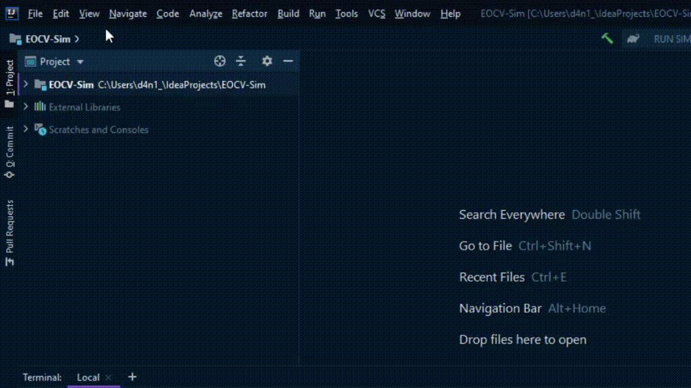<br/>

### Creating pipelines (with the old installation method)

**This part is also only applicable if you downloaded EOCV-Sim with the [old method explained in the README](/README.md#altenative-installation-method-intellij-idea)**

As said before, all of the pipeline classes **should be** placed under the *org.firstinspires.ftc.teamcode* package, in the *TeamCode* module. This way, they will be
automatically detected by the simulator and will be selectionable from the GUI.

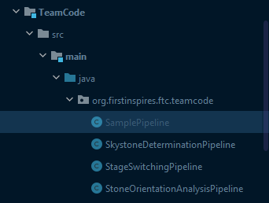<br/>

*(Also, the simulator already comes by default with some EasyOpenCV samples)*<br/>

To create a new java class, follow these steps:<br/>
1) In the project files menu, open the TeamCode module
2) Find the *org.firstinspires.ftc.teamcode* package and right click on it
3) On the context menu, click on *New > Java Class*
4) A new menu will appear, type a name and make sure the *Class* option is selected
5) Once you have typed a name, press enter and the class will be created

Here's a quick gif illustrating these steps:<br/>

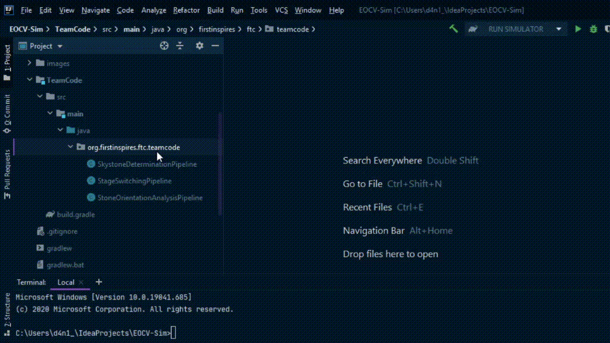<br/>

## Empty sample pipeline

If you want your class to be a pipeline, it **should also** extend the EOCV's OpenCvPipeline abstract class and override the processFrame() method.<br/><br/>
Here's a empty pipeline template, with the SamplePipeline class we created before:

```java
package org.firstinspires.ftc.teamcode;

import org.opencv.core.Mat;
import org.openftc.easyopencv.OpenCvPipeline;

public class SamplePipeline extends OpenCvPipeline {

    @Override
    public void init(Mat input) {
        /* Executed once, when the pipeline is selected */
    }

    @Override
    public Mat processFrame(Mat input) {
        /* Executed each frame, the returned mat will be the one displayed */
        /* Processing and detection stuff here */
        return input; // Return the input mat
                      // (Or a new, processed mat)
    }

    @Override
    public void onViewportTapped() {
        /*
         * Executed everytime when the pipeline view is tapped/clicked.
         * This is executed from the UI thread, so whatever you do here,
         * it must be done it quickly.
         */
    }

}
```

### For more detailed information about pipelines, make sure to check out the [EasyOpenCV docs](https://github.com/OpenFTC/EasyOpenCV/blob/master/doc/user_docs/pipelines_overview.md)

## Input Sources

To allow multiple ways to test your pipeline, the simulator comes with *Input Sources*, which are the ones in charge of giving your pipeline the input Mats, As of right now, the sim has three types of Input Sources:

- **Image Source:**
    - These will feed your pipeline with a static image loaded in your computer's hard drive.
    - To save resources, your pipeline will just run once when you select an image source, but you can optionally resume the pipeline execution by clicking the "Pause" button under the pipeline selector.
- **Camera Source:**
    - These will feed your pipeline with a constantly changing video stream from a specified camera plugged in your computer.
    - Unlike the image sources, these will not pause the execution of you pipeline by default, but you can click the "Pause" button to pause it at any time.
- **Video Source:**
    - These will feed your pipeline with a constantly changing video stream from a file in your hard drive, pause rules are the same as camera sources.
    - Most tested video format is *\*.avi*, although it depends on your operating system's codecs.
  
### Creating an Input Source

   1) Go to the panel located at the right. Under the "Sources" section, click on "Create"<br/><br/>
   
      <br/><br/>
      
      - Alternatively, you can also go to *File -> New -> Input Source* in the top bar menu<br/><br/>
      
        <br/><br/>
      
   2) Select the type of InputSource you want to create. If you're on the "Sources" section, click on next.<br/><br/>

## Telemetry

There's also an SDK-like Telemetry implementation in the sim. 
In 1.1.0 (when it was introduced) you could simply access it from your pipeline since it was an instance variable ```telemetry```.

But, starting 2.0.0, to make it more alike to an actual EOCV pipeline, you need to implement a public constructor which takes a Telemetry parameter, then creating and setting an instance variable from that constructor:

```java
package org.firstinspires.ftc.teamcode;

import org.opencv.core.Mat;
import org.openftc.easyopencv.OpenCvPipeline;

import org.firstinspires.ftc.robotcore.external.Telemetry;

public class TelemetryPipeline extends OpenCvPipeline {

    Telemetry telemetry;

    public TelemetryPipeline(Telemetry telemetry) {
        this.telemetry = telemetry;
    }

    @Override
    public Mat processFrame(Mat input) {
        telemetry.addData("[Hello]", "World!");
        telemetry.update();
        return input; // Return the input mat
    }

}
```

Which then produces the following result:<br/>

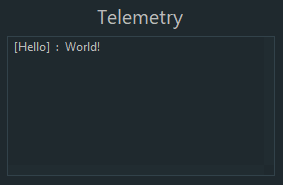<br/>

For further information about telemetry, you can check out the [SDK docs on Telemetry](https://ftctechnh.github.io/ftc_app/doc/javadoc/org/firstinspires/ftc/robotcore/external/Telemetry.html), note that not all the methods are implemented for EOCV-Sim

## Variable Tuner

From 2.0.0 and on, there's a variable tuner implemented into the simulator, inspired by the one in FTC Dashboard, it allows to edit public, non-final variables from your pipeline in real time seamlessly through Java reflection.<br/>

This variable tuner can be found at the bottom part of the sim, click on the divider bar to open it:<br/>

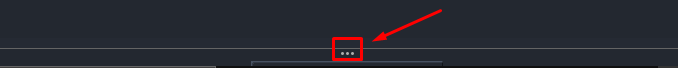<br/>
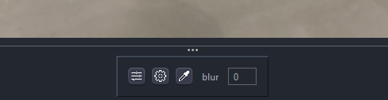<br/>

This screenshot is from the DefaultPipeline (the one selected when the simulator opens). This variable controls the blur value for the output Mat. You can play with this value to see the tuner functionality.<br/><br/>
If we look into the DefaultPipeline code, we can see that it is simply a **public int** instance variable, not marked as final (alongside with the Telemetry initialization stuff we explained before):<br/>

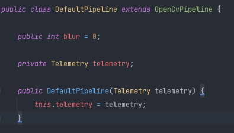<br/>

The tuner supports a handful of Java types such as most primivites (int, boolean...) and some other types from OpenCV.<br/>
The full list of types currently supported by the tuner on the latest version is:<br/>

    Java: 
      - int (or Integer)
      - float (or Float)
      - double (or Double)
      - long (or Long)
      - boolean (or Boolean)
      - String
      - Enums
    
    OpenCV:
      - Scalar
      - Rect
      - Point
    
### Tuner functionality

In the screenshot above, you might have noticed we have three buttons in the field (these buttons appear on field types with at least one textbox/slider). Those were introduced in 2.1.0 to provide extra functionality to the tuner. We have three buttons (options), five parts:

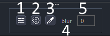<br/>

1) **Text fields/slider toggle**
   - Toggles between sliders and textboxes for setting the value to this field
2) **Config**
   - Configures various aspects of this tunable field, such as the slider range and picker's color space
3) **Color picker** 
   - Turns on "color picker" mode, which allows to grab a single pixel from the image and sets it to the selected tunable field
   - Sets the color value to the first four textboxes/sliders of this field, if less than four textboxes/sliders are available, it will set the values to the available ones and discard all of the value(s) that can't be copied into the field 
4) **Name**
   - Displays the name of the variable (declared in the pipeline)
5) **Text field**
   - The part in which you can modify the value for this field. Can be toggled to sliders as mentioned before
   - Some fields (such as OpenCV Scalars) might have more than one text field

### Tuner configuration

When opening the config for a specific field with the aforementioned button (figure #2), you'll see this popup:

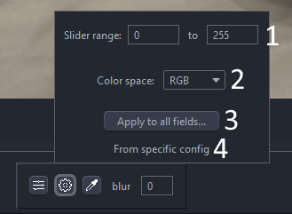<br/>

1) **Slider range**
   - Sets the **range for the sliders**, defaults to 0-255 since that's the most commonly used, especially for color tuning.
   - Negative & positive values allowed, decimal values are allowed only if the field is decimal (such as floats or doubles)
2) **Color space**
   - Sets the **color space** for the color picker to return. Defaults to RGB
3) **Apply to all fields...**
   - Applies **this configuration** globally or specifically to this field *(see below for further details)*
4) **Config source**
   - Displays the source of this config: default global, global, local or specific *(see below for further details)*

#### Applying tuner configuration
    
When using the variable tuner and making configurations, it's sometimes convenient to have some way to store those configurations so that you don't have to reconfig for every field, or every time you select a new pipeline.<br/>

For this, the sim has a "apply to all" functionality to store common configurations:

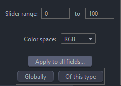<br/>

As you can see in the image, when clicking the "apply to all" button, two options appear:
    
- **"Globally"**
    - Applies the configuration **globally** (to all fields without an "specific" config)
    - Note that this doesn't mean that by clicking this option will override all configurations, see below.    
- **"Of this type"** (or "specific")
    - Applies the configuration to all fields **of the same type** as the current config one. 
    - (In the case of the example in the screenshot, the blur field in DefaultPipeline, this config will be applied to all *int* fields)

#### Tuner configuration priority order

As mentioned before, by applying a "global" configuration, it doesn't mean that it will override the specific configs.<br/>
Rather, there's an specific priority order to determine the configuration that will be given to each tunable field:

1) **Local**
    - This is the one that applies when you modify the configuration values without applying *"globally"* or *"specifically to this type"*
    - Simply means that you modified the config without saving it. It will be reset once you select a different pipeline
2) **Type-specific**
    - If there's a specific configuration for the type *(such as **int** in the example)*, it will be the one that gets the most priority
    - You can define a "type-specific" configuration by clicking on "Applying to all fields..." -> "Of this type"
3) **Global**
    - If there's not a type-specific configuration present, the configuration will default to the "global" one
    - You can define a "Global" configuration by clicking on "Applying to all fields..." -> "Globally"
5) **Tunable field suggestion**
    - If there's not a global configuration, but the current tunable field suggests a *"mode" (sliders or textboxes)*, then that suggestion will be applied
    - For example, with OpenCV's Scalars, the tunable field suggest to use sliders since it's more convenient for tuning this type of field
6) **Default global**
    - If there's not any configuration or suggestion at all, the field will default to the *"default global"* configuration
    - The default config has a slider range from 0 to 255 and a color space of RGB
    
### Sample usage of the variable tuner

Let's say we need to tune a threshold for finding the ring stack in the 2020-2021 "Ultimate Goal" game. For this, we will use the YCrCb color space since it's one of the most used ones in FTC and it behaves better under different lightning conditions. (see [this article](https://learnopencv.com/color-spaces-in-opencv-cpp-python/) for more extended explaination and comparation of different color spaces).<br/>

We can write a simple pipeline for achieving this, taking advantage of the variable tuner. Here's an example code with detailed comments:

```java
package org.firstinspires.ftc.teamcode;

import org.opencv.core.Core;
import org.opencv.core.Mat;
import org.opencv.core.Scalar;
import org.opencv.imgproc.Imgproc;
import org.openftc.easyopencv.OpenCvPipeline;

public class SimpleThresholdPipeline extends OpenCvPipeline {

    /*
     * These are our variables that will be
     * modifiable from the variable tuner.
     *
     * Scalars in OpenCV are generally used to
     * represent color. So our values in the
     * lower and upper Scalars here represent
     * the Y, Cr and Cb values respectively.
     *
     * YCbCr, like most color spaces, range
     * from 0-255, so we default to those
     * min and max values here for now, meaning
     * that all pixels will be shown.
     */
    public Scalar lower = new Scalar(0, 0, 0);
    public Scalar upper = new Scalar(255, 255, 255);

    /*
     * A good practice when typing EOCV pipelines is
     * declaring the Mats you will use here at the top
     * of your pipeline, to reuse the same buffers every
     * time. This removes the need to call mat.release()
     * with every Mat you create on the processFrame method,
     * and therefore, reducing the possibility of getting a
     * memory leak and causing the app to crash due to an
     * "Out of Memory" error.
     */
    private Mat ycrcbMat       = new Mat();
    private Mat binaryMat      = new Mat();
    private Mat maskedInputMat = new Mat();

    @Override
    public Mat processFrame(Mat input) {
        /*
         * Converts our input mat from RGB to YCrCb.
         * EOCV ALWAYS returns RGB mats, so you'd
         * always convert from RGB to the color
         * space you want to use.
         *
         * Takes our "input" mat as an input, and outputs
         * to a separate Mat buffer "ycrcbMat"
         */
        Imgproc.cvtColor(input, ycrcbMat, Imgproc.COLOR_RGB2YCrCb);

        /*
         * This is where our thresholding actually happens.
         * Takes our "ycrcbMat" as input and outputs a "binary"
         * Mat to "binaryMat" of the same size as our input.
         * "Discards" all the pixels outside the bounds specified
         * by the scalars above (and modifiable with EOCV-Sim's
         * live variable tuner.)
         *
         * Binary meaning that we have either a 0 or 255 value
         * for every pixel.
         *
         * 0 represents our pixels that were outside the bounds
         * 255 represents our pixels that are inside the bounds
         */
        Core.inRange(ycrcbMat, lower, upper, binaryMat);

        /*
         * Release the reusable Mat so that old data doesn't
         * affect the next step in the current processing
         */
        maskedInputMat.release();

        /*
         * Now, with our binary Mat, we perform a "bitwise and"
         * to our input image, meaning that we will perform a mask
         * which will include the pixels from our input Mat which
         * are "255" in our binary Mat (meaning that they're inside
         * the range) and will discard any other pixel outside the
         * range (RGB 0, 0, 0. All discarded pixels will be black)
         */
        Core.bitwise_and(input, input, maskedInputMat, binaryMat);

        /*
         * The Mat returned from this method is the
         * one displayed on the viewport.
         *
         * To visualize our threshold, we'll return
         * the "masked input mat" which shows the
         * pixel from the input Mat that were inside
         * the threshold range.
         */
        return maskedInputMat;
    }

}
```

And so, when initially selecting this pipeline in the simulator, it's initial state should look something like this:<br/>

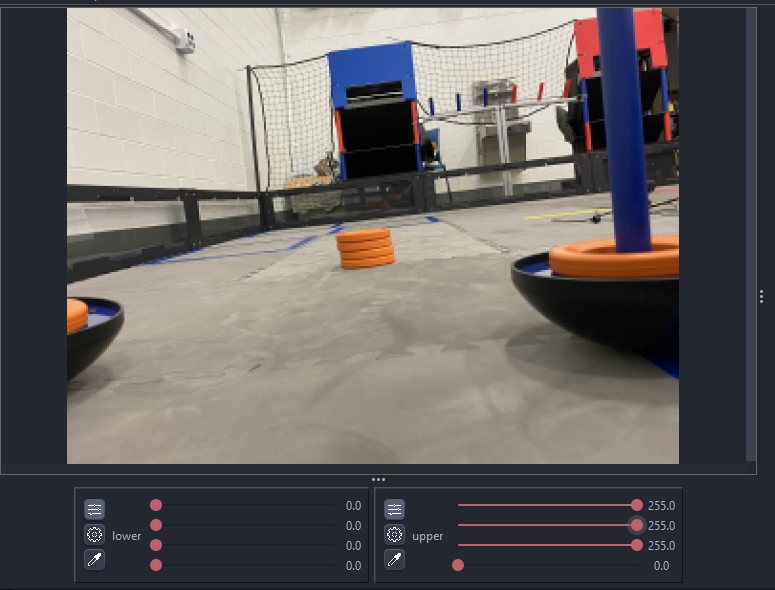<br/>

All pixels from the input Mat are visible entirely, this is because we specified a range of 0-255 for all three channels (see the sliders values). Since those values are the minimum (0%) and maximum (100%) for YCrCb respectively, all pixels are able to go through our "threshold".<br/>

Other thing to note here is that we have sliders instead of textboxes for both Scalars. This is the "default" behavior when using a variable of this type, since sliders are the most optimal option to tune thresholds. This behavior can be overriden by any user configuration, by toggling off the button located at the top left with the sliders icon.<br/><br/>
If you want to permanently change this, go into the field config by clicking on the button with the gear icon, then click "apply to all" and select whether you wanna apply this config to all fields globally, or specifically to the field type (Scalar in this case), as explained before.<br/>

Anyways, back to the sample. After a bit of playing around with the sliders, it's possible to come up with some decent values which successfully filter out the orange ring stack out of everything else:<br/>

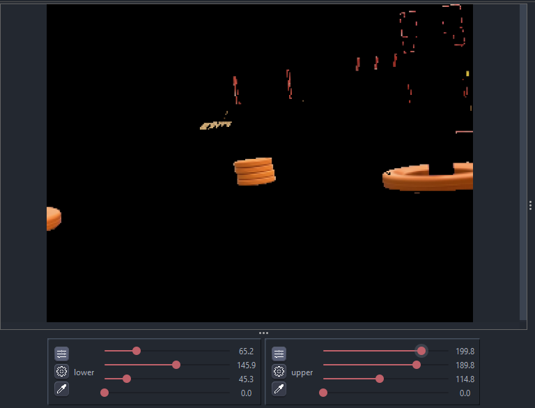<br/>

A problem with the YCrCb color space, especially this year, is that the difference between red and orange is very subtle. So therefore we need to play with the values for a good while until we find some that filters out the red from the goals but displays the ring stack. Or do some other technique alongside thresholding such as [FTCLib's contour ring pipeline](https://github.com/FTCLib/FTCLib/blob/3a43b191b18581a2f741588f9b8ab60c13b7fb6c/core/vision/src/main/java/com/arcrobotics/ftclib/vision/UGContourRingPipeline.kt#L46) with the "horizon" mechanism.<br/>

Some other nice features can be added to this sample, such as an enum for choosing the color space and Telemetry:

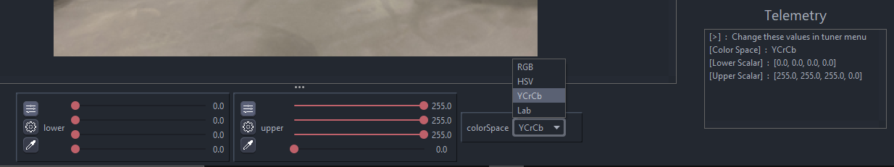<br/>

To keep this explaination simple, you can find the final pipeline [here](https://github.com/serivesmejia/EOCV-Sim/blob/dev/TeamCode/src/main/java/org/firstinspires/ftc/teamcode/SimpleThresholdPipeline.java) with the new demonstrated features, in the TeamCode module, since serves as a good sample alongside other sample classes from EOCV itself.
